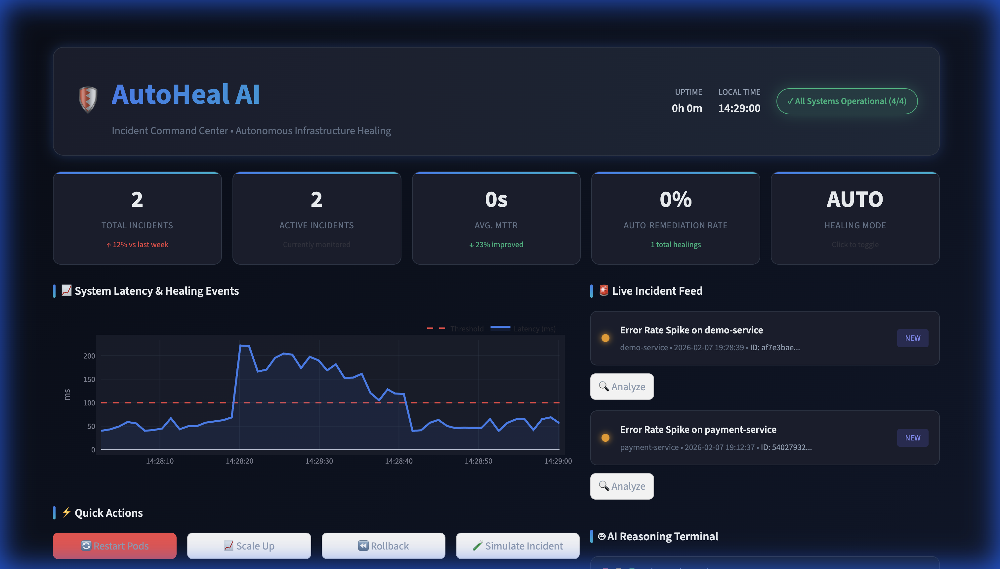
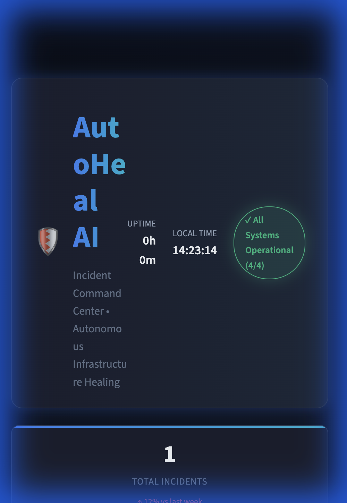

<p align="center">
  
</p>

<h1 align="center">🛡️ AutoHeal AI</h1>

<p align="center">
  <strong>Autonomous AIOps Self-Healing Infrastructure Platform</strong>
</p>

<p align="center">
  <a href="#-features"></a>
  <a href="#-quick-start"></a>
  <a href="#-architecture"></a>
  <a href="#-dashboard"></a>
</p>

<p align="center">
  <a href="https://github.com/JhonHTipas21/AutoHeal-AI/stargazers"></a>
  <a href="https://github.com/JhonHTipas21/AutoHeal-AI/network/members"></a>
</p>

---

<p align="center">
  An enterprise-grade <strong>autonomous infrastructure healing system</strong> that monitors, analyzes, and automatically remediates incidents using <strong>AI-driven OODA loop</strong> decision making. Built for DevOps/SRE teams who want to reduce MTTR and automate incident response.
</p>

---

## 📸 Screenshots

<table>
  <tr>
    <td width="50%">
      
      <p align="center"><strong>Command Center Dashboard</strong></p>
    </td>
    <td width="50%">
      
      <p align="center"><strong>System Status Overview</strong></p>
    </td>
  </tr>
</table>

> 📍 **Your screenshots go in:** `docs/images/`
> 
> Add more images like: `api-docs.png`, `incident-detail.png`, `healing-flow.png`

---

## ✨ Features

<table>
  <tr>
    <td align="center" width="33%">
      <h3>🔍 Real-time Monitoring</h3>
      <p>Prometheus metrics collection with intelligent anomaly detection using dynamic thresholds</p>
    </td>
    <td align="center" width="33%">
      <h3>🧠 Log Intelligence</h3>
      <p>AI-powered log analysis with SLM for error classification and root cause inference</p>
    </td>
    <td align="center" width="33%">
      <h3>🎯 Incident Correlation</h3>
      <p>Automatic event correlation by time window and service topology</p>
    </td>
  </tr>
  <tr>
    <td align="center" width="33%">
      <h3>🔄 OODA Healing Loop</h3>
      <p>Observe → Orient → Decide → Act autonomous healing cycle with confidence scoring</p>
    </td>
    <td align="center" width="33%">
      <h3>☸️ Kubernetes Actions</h3>
      <p>Pod restart, scaling, rollback with built-in safety controls and dry-run mode</p>
    </td>
    <td align="center" width="33%">
      <h3>📋 Full Audit Trail</h3>
      <p>Complete reasoning traces and action logging for compliance and debugging</p>
    </td>
  </tr>
</table>

---

## 🏗️ Architecture

```
                              ┌──────────────────────────────────────────┐
                              │         🖥️ COMMAND CENTER                │
                              │        Dashboard (Streamlit)             │
                              │              :8501                       │
                              └─────────────────┬────────────────────────┘
                                                │
                    ┌───────────────────────────┼───────────────────────────┐
                    │                           │                           │
                    ▼                           ▼                           ▼
    ┌───────────────────────┐   ┌───────────────────────┐   ┌───────────────────────┐
    │   📊 MONITORING       │   │   📝 LOG INTELLIGENCE │   │   📈 AUDIT SERVICE    │
    │      Service          │   │       Service         │   │       Service         │
    │       :8000           │   │        :8001          │   │        :8005          │
    │                       │   │                       │   │                       │
    │  • Prometheus Metrics │   │  • SLM Log Analysis   │   │  • Decision Logging   │
    │  • Anomaly Detection  │   │  • Error Classification│   │  • Reasoning Traces  │
    │  • Alert Generation   │   │  • Commit Correlation │   │  • Compliance Audit   │
    └───────────┬───────────┘   └───────────┬───────────┘   └───────────────────────┘
                │                           │                           ▲
                │                           │                           │
                └───────────────┬───────────┘                           │
                                │                                       │
                                ▼                                       │
                ┌───────────────────────────────┐                       │
                │   🚨 INCIDENT MANAGER         │                       │
                │         Service               │                       │
                │          :8002                │                       │
                │                               │                       │
                │  • Event Correlation          │                       │
                │  • Severity Assessment        │                       │
                │  • Lifecycle Management       │                       │
                └───────────────┬───────────────┘                       │
                                │                                       │
                                ▼                                       │
                ┌───────────────────────────────┐                       │
                │   🤖 AUTOHEAL AGENT           │───────────────────────┘
                │         Service               │
                │          :8003                │
                │                               │
                │  ┌─────────────────────────┐  │
                │  │     OODA LOOP ENGINE    │  │
                │  │  ┌───┐ ┌───┐ ┌───┐ ┌───┐│  │
                │  │  │ O │→│ O │→│ D │→│ A ││  │
                │  │  └───┘ └───┘ └───┘ └───┘│  │
                │  └─────────────────────────┘  │
                └───────────────┬───────────────┘
                                │
                                ▼
                ┌───────────────────────────────┐
                │   ☸️ K8S EXECUTOR             │
                │         Service               │
                │          :8004                │
                │                               │
                │  • Pod Restart                │
                │  • Horizontal Scaling         │
                │  • Deployment Rollback        │
                │  • Resource Adjustment        │
                └───────────────────────────────┘
```

---

## 🚀 Quick Start

### Prerequisites

```bash
# Required
Python 3.9+
pip

# Optional (for full deployment)
Docker & Docker Compose
Kubernetes cluster
```

### ⚡ One-Line Start (Development)

```bash
# Clone and run
git clone https://github.com/JhonHTipas21/AutoHeal-AI.git
cd AutoHeal-AI
pip install -r requirements.txt
./scripts/setup-dev.sh  # Starts all services
```

### 🐳 Docker Compose

```bash
docker-compose up -d
```

### 📦 Manual Start

```bash
# Terminal 1: Audit Service
cd services/audit-service
PYTHONPATH=../.. python3 -m uvicorn src.main:app --port 8005

# Terminal 2: Incident Manager  
cd services/incident-manager
PYTHONPATH=../.. python3 -m uvicorn src.main:app --port 8002

# Terminal 3: AutoHeal Agent
cd services/autoheal-agent
PYTHONPATH=../.. python3 -m uvicorn src.main:app --port 8003

# Terminal 4: K8s Executor
cd services/k8s-executor
PYTHONPATH=../.. python3 -m uvicorn src.main:app --port 8004

# Terminal 5: Dashboard
cd dashboard
python3 -m streamlit run app.py --server.port 8501
```

---

## 🎮 Dashboard

The **Command Center** dashboard provides a professional NOC-style interface:

| Component | Description |
|-----------|-------------|
| 📊 **KPI Cards** | Total incidents, MTTR, auto-remediation rate, healing mode |
| 📈 **Latency Chart** | Real-time metrics with threshold visualization |
| 🚨 **Incident Feed** | Live stream with severity indicators |
| 🤖 **AI Terminal** | OODA reasoning trace and decisions |
| ⚡ **Quick Actions** | Restart, Scale, Rollback, Simulate buttons |
| 🔄 **Mode Toggle** | Manual / Semi-Auto / Autonomous |

### Access Points

| Service | URL | Description |
|---------|-----|-------------|
| 🖥️ Dashboard | http://localhost:8501 | Main UI |
| 📚 API Docs | http://localhost:8002/docs | Incident Manager |
| 🤖 Agent API | http://localhost:8003/docs | AutoHeal Agent |
| ☸️ K8s API | http://localhost:8004/docs | K8s Executor |

---

## 🧪 Test the System

```bash
# 1. Create a test incident
curl -X POST http://localhost:8002/api/v1/events/anomaly \
  -H "Content-Type: application/json" \
  -d '{
    "event_id": "test-001",
    "anomaly_type": "error_rate_spike",
    "severity": "high",
    "target_service": "payment-service",
    "target_namespace": "production",
    "metric_name": "error_rate",
    "current_value": 0.15,
    "threshold_value": 0.05
  }'

# 2. View incidents
curl http://localhost:8002/api/v1/incidents | jq

# 3. Trigger autonomous healing
curl -X POST http://localhost:8003/api/v1/heal \
  -H "Content-Type: application/json" \
  -d '{
    "incident_id": "<INCIDENT_ID>",
    "target_service": "payment-service",
    "target_namespace": "production",
    "severity": "high",
    "root_cause": "error_rate_spike"
  }'

# 4. Check healing history
curl http://localhost:8003/api/v1/history | jq
```

---

## 📁 Project Structure

```
AutoHeal-AI/
│
├── 📂 services/
│   ├── 📊 monitoring/           # Prometheus integration & anomaly detection
│   ├── 📝 log-intelligence/     # SLM log analysis & commit correlation
│   ├── 🚨 incident-manager/     # Event correlation & lifecycle management
│   ├── 🤖 autoheal-agent/       # OODA healing engine & decision maker
│   ├── ☸️ k8s-executor/          # Kubernetes action execution
│   └── 📋 audit-service/        # Decision logging & compliance
│
├── 🖥️ dashboard/                # Streamlit Command Center UI
│
├── 🔧 shared/                   # Common utilities & schemas
│   ├── utils/                   # HTTP client, logging, retry logic
│   └── schemas/                 # Pydantic models for events & actions
│
├── 🏗️ infrastructure/           # Prometheus, Grafana, Loki configs
│
├── 📸 docs/images/              # Screenshots for README
│
├── 🐳 docker-compose.yml        # Full stack deployment
├── 📋 requirements.txt          # Python dependencies
└── 📖 README.md                 # You are here!
```

---

## 🔄 OODA Healing Loop

<p align="center">
  
</p>

The AutoHeal Agent implements a military-grade **OODA Loop** (Observe, Orient, Decide, Act) for autonomous decision making:

| Phase | Action | Description |
|-------|--------|-------------|
| 👁️ **Observe** | Gather Data | Collect metrics, logs, and incident context |
| 🧭 **Orient** | Analyze | Pattern matching, root cause inference, severity assessment |
| 💡 **Decide** | Plan | Generate healing plan with confidence score and risk assessment |
| ⚡ **Act** | Execute | Perform healing actions via K8s Executor with validation |

---

## 🛠️ Tech Stack

<p align="center">
  
  
  
  
  
  
  
  
</p>

---

## 🤝 Contributing

Contributions are welcome! Please feel free to submit a Pull Request.

1. Fork the project
2. Create your feature branch (`git checkout -b feature/AmazingFeature`)
3. Commit your changes (`git commit -m 'Add some AmazingFeature'`)
4. Push to the branch (`git push origin feature/AmazingFeature`)
5. Open a Pull Request

---

## 📜 License

Distributed under the MIT License. See `LICENSE` for more information.

---

## 👨‍💻 Author

<p align="center">
  <strong>Jhon Harvey Tipas Solis</strong><br>
  <a href="https://github.com/JhonHTipas21">GitHub</a> •
  <a href="https://linkedin.com/in/jhonharveytipas">LinkedIn</a>
</p>

---

<p align="center">
  <strong>⭐ Star this repo if you find it useful! ⭐</strong>
</p>

<p align="center">
  Built with ❤️ and ☕ for the DevOps/SRE community
</p>
